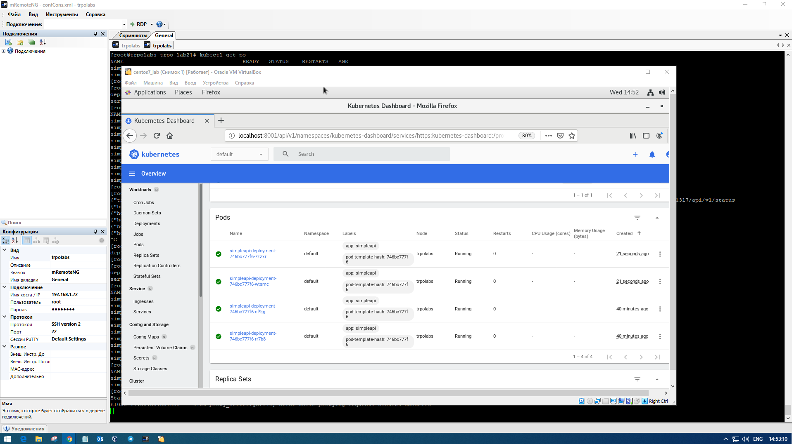

## I
* __Название дисциплины:__ Технологии разработки программного обеспечения
* __Название лабораторной работы:__ Лабораторная работа №2: создание кластера Kubernetes и деплой приложения
* __ФИО и группа:__ Бадулин А.С. ЗМБД2031
* __Цель лабораторной работы:__ Целью лабораторной работы является знакомство с кластерной архитектурой на примере Kubernetes, а также деплоем приложения в кластер.
## II
#### deployment.yml
```
apiVersion: apps/v1
kind: Deployment
metadata:
  name: simpleapi-deployment
spec:
  replicas: 2
  selector:
    matchLabels:
      app: simpleapi
  strategy:
    rollingUpdate:
      maxSurge: 1
      maxUnavailable: 1
    type: RollingUpdate
  template:
    metadata:
      labels:
        app: simpleapi
    spec:
      containers:
        - image: simpleapi:v1
          imagePullPolicy: Never
          name: simpleapi
          ports:
            - containerPort: 8080
      hostAliases:
      - ip: "192.168.1.72"
        hostnames:
        - db.trpo.local
 ```
#### service.yml
```
apiVersion: v1
kind: Service
metadata:
  name: simpleapi-service
spec:
  type: NodePort
  ports:
    - nodePort: 31317
      port: 8080
      protocol: TCP
      targetPort: 8080
  selector:
    app: simpleapi
```
### Шаг 3.3


### Шаг 3.5


### Видеодемонстрация
[ссылка](https://yadi.sk/i/EvDufo5aYtx_UQ)
